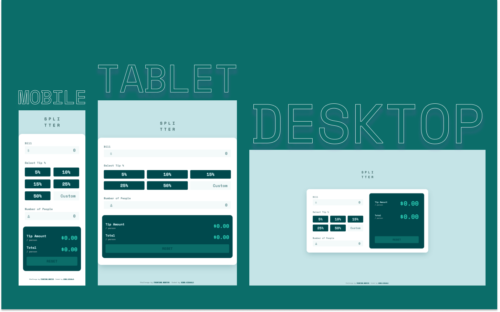

# Frontend Mentor - Tip Calculator App Solution

This is a solution to the [Tip Calculator App Challenge on Frontend Mentor](https://www.frontendmentor.io/challenges/tip-calculator-app-ugJNGbJUX).

## Table of contents

- [Overview](#overview)
  - [The challenge](#the-challenge)
  - [Screenshot](#screenshot)
  - [Links](#links)
- [My process](#my-process)
  - [Built with](#built-with)
  - [What I learned](#what-i-learned)
  - [Continued development](#continued-development)
  - [Useful resources](#useful-resources)
- [Author](#author)

## Overview

### The challenge

Frontend Mentor's challenges

Users should be able to:

- View the optimal layout for the app depending on their device's screen size
- See hover states for all interactive elements on the page
- Calculate the correct tip and total cost of the bill per person

Challenges added by me

Users should be able to:

- Dynamically calculate the bill, no matter in what order the inputs are filled
  - Seamlessly change form percentage buttons to `Custom` percentage input and calculate the value accordingly
  - Calculate the amount per person even if no tip amount it checked or inserted
- See proper error messages if the input is invalid:
  - If the user inserts '0': `Can't be zero`
  - If the user inserts a number that starts with zero: `Can't start with zero`
  - If more than two dots are inserted for decimal places: `Can't have two dots`
  - If the user tries to insert a huge amount or invalid number of people: `WTF!!! WHO ARE YOU???`
  - If the input is anything other than a number or if it's a negative number: `Positive numbers only`

### Screenshot

### Links

- Live Site URL: [https://kens-visuals.github.io/tip-calculator-app/](https://kens-visuals.github.io/tip-calculator-app/)
- Solution URL: [TO_BE_UPDATED](TO_BE_UPDATED)

## My process

### Built with

- Semantic HTML5 markup
- SCSS custom properties
- CSS Flexbox
- CSS Grid
- Vanilla JS
- Mobile-first workflow

### What I learned

I've learned so much with this project, especially in JS. I've got to admit this is my most favorite project by far. Furthermore, I tried to make it as close to a real life tip calculator as possible, because I wanted to build a tool that will be used by me, my friends, and maybe some other users as well 😅 I really put my heart and soul into this project, and I'm going to keep adding more features into it as well. I hope you enjoy using it as much, as I enjoyed building it. And if you really enjoy using it, I have a quick tip to help you access it more easily from your phone's home screen. And here's how to do it:

> ### iOS
>
> 1.  Open Safari
> 2.  Tap the **Share** button on the bottom of the page. It looks like a square with an arrow pointing out of the top.
> 3.  In the list of options that appear, scroll down and tap on **Add to Home Screen**. The _Add to Home Screen_ dialog box will appear.
> 4.  Choose a name for the website shortcut on your home screen.
> 5.  Click **Add** when you're done. Safari will close automatically, and you will be taken to where the icon is located on your iPhone’s or iPad's home screen.
> 6.  Now just tap the new "app" or shortcut on your home screen, and it will open the website in its own navigation window, independent of what you have open in Safari.

> ### Android
>
> 1. Open Chrome.
> 2. Navigate to the website or web page you want to pin to your home screen.
> 3. Tap the menu icon (3 dots in upper right-hand corner) and tap Add to home screen.
> 4. Choose a name for the website shortcut, then Chrome will add it to your home screen.

### Continued development

I'd really like to build a similar project, but with React. I'm planning to build a fully functioning calculator with React JS and SCSS. Perhaps, I may try experimenting with some tools such as Tailwind CSS to see what all the hype is about.

### Useful resources

Since the project is mostly with JS, I'll share a couple of resources all about JS and DOM manipulations.

- [htmldom.dev](https://htmldom.dev)
- [javascript.info](https://javascript.info)
- [programiz.com](https://www.programiz.com/javascript)
- [java5cript.com](https://www.java5cript.com)
- [javascripttutorial.net](https://www.javascripttutorial.net)
- [eloquentjavascript.net](https://eloquentjavascript.net/index.html)

## Author

- Frontend Mentor - [@kens-visuals](https://www.frontendmentor.io/profile/kens-visuals)
- Codewars - [@kens_visuals](https://www.codewars.com/users/kens_visuals)
- CodePen - [@kens-visuals](https://codepen.io/kens-visuals)
